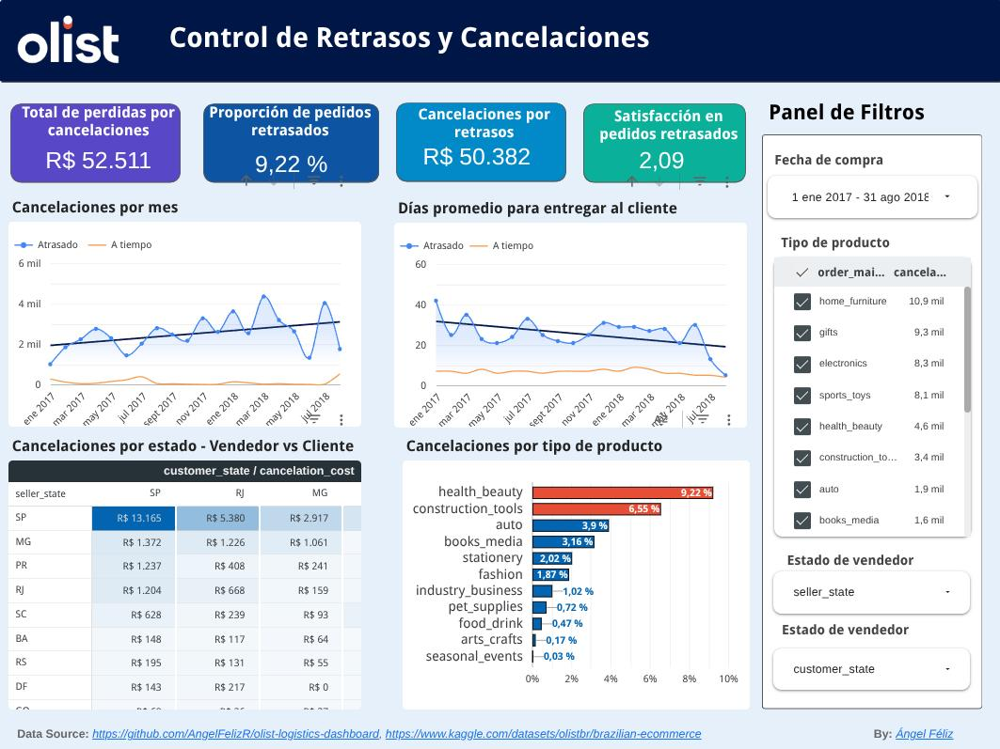
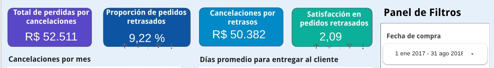
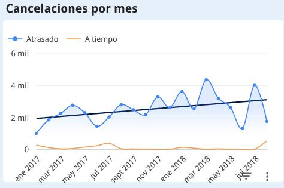
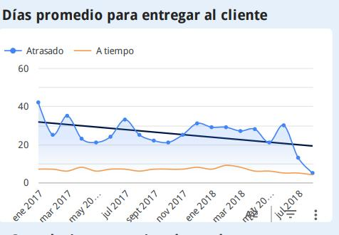
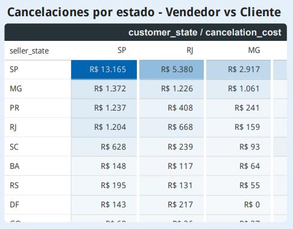
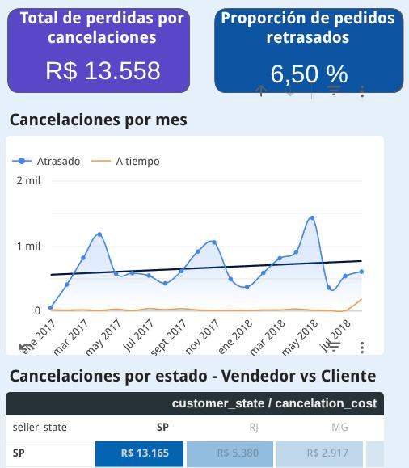
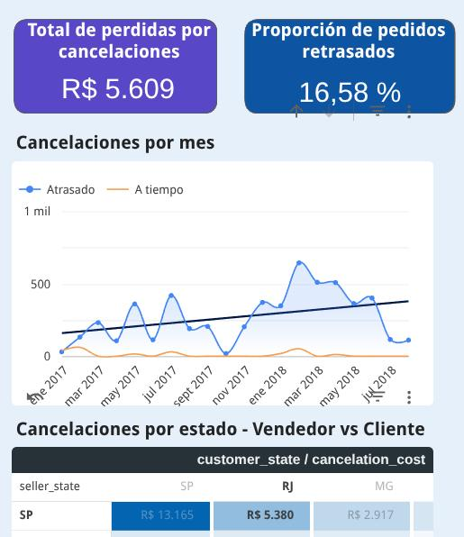
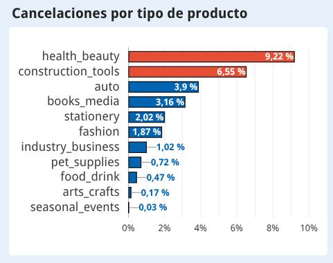
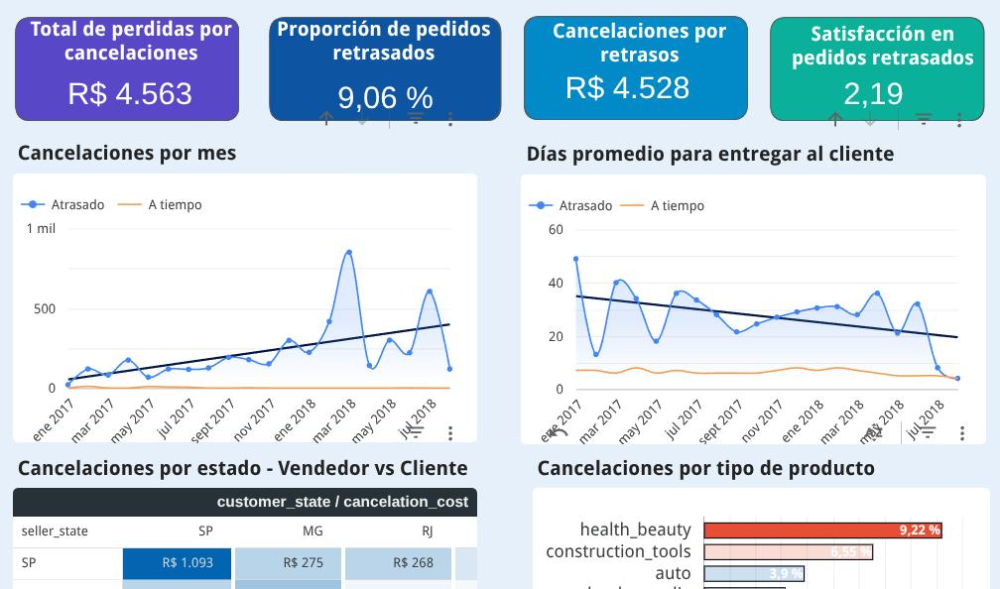

---
format:
  pdf:
    pdf-engine: xelatex
    mainfont: "Liberation Serif"
    fontsize: 12pt
    linestretch: 2
    documentclass: scrartcl
    papersize: letter
    toc: true
    toc-depth: 2
    number-sections: true
    colorlinks: true
    geometry:
      - margin=1in
    include-in-header:
      text: |
        \usepackage{fancyhdr}
        \usepackage{graphicx}
    include-before-body:
      text: |
        \begin{titlepage}
        \centering
        {\includegraphics[width=0.25\textwidth]{logo-sbs.jpg}\par}
        \vspace{1cm}
        {\Huge\bfseries Proyecto Final \par}
        \vspace{1cm}
        {\Large\bfseries Control de Retrasos y Cancelaciones en Olist \par}
        \vspace{1cm}
        {\large Sustentante \par}
        {\Large\bfseries Ángel Esteban Féliz Ferreras \par}
        \vspace{1cm}
        {\large Maestría \par}
        {\Large\bfseries Ciencia de Datos \par}
        \vspace{1cm}
        {\large Profesor \par}
        {\Large\bfseries Jorge Valtuena \par}
        \vspace{1cm}
        {\large Asignatura \par}
        {\Large\bfseries Visualización de Datos \par}
        \vfill
        {\large Santo Domingo, República Dominicana\par}
        {\large \today \par}
        \end{titlepage}
        \newpage
lang: es
---

\newpage

# Introducción

Este documento complementa el dashboard interactivo desarrollado en Looker Studio para analizar el efecto de las cancelaciones en los pedidos de Olist. A partir del dataset público **Brazilian E‑Commerce Public Dataset** (disponible en [Kaggle](https://www.kaggle.com/datasets/olistbr/brazilian-ecommerce)), se construyó una tabla única enriquecida que consolida información de clientes, vendedores, productos, pagos, reseñas y geolocalización, permitiendo responder preguntas clave sobre puntualidad de entregas, causas de retrasos y su impacto financiero.

Para mí, este proyecto ha representado una gratificante aventura: venir del ecosistema R y enfrentarme por primera vez a un proceso de transformación de datos tan avanzado con pandas. Fue necesario integrar nueve archivos CSV originales, calcular indicadores logísticos (días de retraso, tiempos de manipulación y tránsito, margen, coste de cancelación, etc.) y exportar un archivo `orders_processed.xlsx` que, cargado como Google Sheet, alimenta el dashboard. Todo el pipeline de preparación se desarrolló con un enfoque reproducible mediante Docker y Nix, y el código completo está disponible en el repositorio [olist-logistics-dashboard](https://github.com/AngelFelizR/olist-logistics-dashboard).

El presente informe recorre cada etapa del trabajo: descripción del dataset y la tabla procesada, objetivos del análisis, decisiones de diseño del dashboard y principales hallazgos obtenidos. Al final, se demuestra cómo el tablero construido proporciona una herramienta narrativa, accionable y orientada a un público no técnico.

\newpage

# Descripción del dataset

## Fuentes originales

Los datos provienen de las siguientes tablas (archivos CSV en la carpeta `raw-data/`):

- **olist_orders_dataset.csv** – pedidos (estado, fechas, estimación de entrega)
- **olist_order_items_dataset.csv** – productos incluidos en cada pedido (precio, flete, límite de envío)
- **olist_products_dataset.csv** – catálogo de productos (categoría, dimensiones, peso)
- **olist_order_reviews_dataset.csv** – reseñas (puntuación, fechas de creación y respuesta)
- **olist_order_payments_dataset.csv** – pagos (tipo, cuotas, valor)
- **olist_customers_dataset.csv** – clientes (ciudad, estado)
- **olist_sellers_dataset.csv** – vendedores (ciudad, estado)
- **olist_geolocation_dataset.csv** – coordenadas geográficas por código postal

\newpage

En la siguiente imagen se presenta el esquema de la base de datos normalizada de Olist.

*Figura 1. Esquema de la base de datos normalizada de Olist. Fuente: Kaggle Brazilian E-Commerce (Olist).*

## Tabla procesada: `orders_processed.xlsx`

Aunque los datos normalizados son excelentes para la operación diaria del negocio, para extraer conclusiones estratégicas es necesario realizar un proceso de agregación que permita responder las preguntas de negocio planteadas.

Con este fin se creó el script `prepare_dashboard_data.py`, mediante el cual se generó una sola tabla desnormalizada con **99 420 filas** (una por pedido) y **38 columnas** que enriquecen la información de órdenes con los datos de productos, clientes y vendedores.

A continuación se describen todas las variables, indicando su origen o fórmula de cálculo:

| Variable | Descripción |
|----------|-------------|
| `order_id` | Identificador único del pedido (proviene de `olist_orders_dataset`) |
| `order_status` | Estado del pedido (delivered, shipped, canceled, etc.) |
| `order_purchase_timestamp` | Fecha/hora de la compra |
| `order_approved_at` | Fecha/hora de aprobación del pedido |
| `order_delivered_carrier_date` | Fecha en que el transportista recoge el pedido del vendedor |
| `order_delivered_customer_date` | Fecha de entrega real al cliente |
| `order_estimated_delivery_date` | Fecha prometida de entrega |
| `review_score` | Puntuación de la reseña (1 a 5) |
| `review_creation_date` | Fecha en que se creó la reseña |
| `review_answer_timestamp` | Fecha en que el cliente respondió la reseña |
| `order_main_category` | Categoría principal del pedido (agrupada en 13 categorías en inglés) |
| `order_main_seller` | ID del vendedor que aportó el producto de mayor valor en el pedido |
| `order_last_shipping_date` | Última fecha límite de envío entre los ítems del pedido |
| `order_volume_cm3` | Volumen total del pedido (suma de productos) |
| `order_weight_g` | Peso total del pedido (suma de productos) |
| `order_price` | Suma de los precios de los productos |
| `order_freight` | Suma de los costos de flete |
| `customer_unique_id` | Identificador único del cliente |
| `customer_city` | Ciudad del cliente |
| `customer_state` | Estado del cliente |
| `customer_lat` | Latitud promedio de la ciudad del cliente |
| `customer_lng` | Longitud promedio de la ciudad del cliente |
| `seller_id` | ID del vendedor (se une con `order_main_seller`) |
| `seller_city` | Ciudad del vendedor |
| `seller_state` | Estado del vendedor |
| `seller_lat` | Latitud promedio de la ciudad del vendedor |
| `seller_lng` | Longitud promedio de la ciudad del vendedor |
| `is_delivered` | Indicador booleano: `True` si el pedido fue entregado (estado `delivered` o fecha de entrega no nula) |
| `delay_days` | Días de retraso (fecha real – fecha estimada, truncado a ≥ 0, solo para entregados) |
| `is_on_time` | `True` si `delay_days == 0` y `is_delivered` |
| `is_delayed` | `True` si `delay_days > 0` |
| `is_pending` | `True` si no ha sido entregado y no tiene reseña (pedido pendiente) |
| `is_canceled` | `True` si el pedido fue marcado como cancelado o si no fue entregado pero cuenta con una review del cliente. | 
| `active_delay_days` | Días que un pedido pendiente ya superó la fecha prometida (calculado hasta la fecha máxima de compra) |
| `total_margin` | Margen estimado (15 % del precio total del pedido) |
| `cancellation_cost` | Coste de cancelación: margen + flete si ya fue recogido por el transportista; solo margen si no fue recogido pero tiene reseña; 0 en otros casos |
| `seller_handling_days` | Días entre la aprobación y la entrega al transportista (solo cuando ambas fechas existen) |
| `transit_days` | Días entre la recogida del transportista y la entrega al cliente (solo cuando ambas fechas existen) |

\newpage

# Objetivo del análisis y público objetivo

**Objetivo.** Proporcionar al equipo de operaciones logísticas una herramienta visual que permita:

- Monitorear mes a mes el impacto financiero de los retrasos.
- Identificar las categorías de producto y regiones con mayor incidencia de retrasos.
- Monitorear cómo las acciones tomadas reducen los tiempos de espera para los clientes.

**Público objetivo.** Responsables de logística, gerentes de marketplace y analistas de negocio sin perfil técnico. Por ello, el dashboard prioriza la claridad visual, la interactividad intuitiva (filtros, tablas) y una narrativa que guía desde lo general hasta lo particular.

\newpage

# Diseño del dashboard

*Figura 2. Vista general del dashboard en Looker Studio. Fuente: elaboración propia.*

El dashboard se implementó en Looker Studio siguiendo una estructura narrativa de 3 secciones:

1. **Visión macro** – Tarjetas con totales importantes que conviene vigilar de manera continua.
2. **Análisis temporal** – Progreso mes a mes del margen perdido y los días de retraso presentados por Olist en los pedidos retrasados frente a los entregados a tiempo.
3. **Causas raíz** – Barras de categorías más retrasadas y heatmap que muestra las rutas de vendedor a cliente para identificar focos de problemas.

\newpage

# Principales hallazgos

En esta sección nos ponemos en los zapatos del encargado de logística para identificar cómo este dashboard le ayudaría a mejorar su gestión y proveer un mejor servicio a los clientes.

## Costo de cancelaciones y el efecto de los retrasos

*Figura 3. Tarjetas de resumen: costo total de cancelaciones, proporción de pedidos retrasados y satisfacción en pedidos retrasados. Fuente: elaboración propia.*

Con la primera sección nuestro encargado ya sabe que desde enero de 2017 la empresa ha perdido **BRL 53k** por concepto de cancelaciones, de los cuales **BRL 50k** (el 96 %) están relacionados con entregas tardías, a pesar de que las entregas tardías solo representan el 9 % de los pedidos vendidos. Además, recibir entregas tardías baja la satisfacción promedio de los clientes a 2 de 5 estrellas, por lo que es un tema crítico que cuesta dinero y reputación a la empresa.

## Tendencia al aumento del costo de cancelación

*Figura 4. Evolución mensual del costo de cancelaciones por retraso. Fuente: elaboración propia.*

Con esta gráfica se obtiene evidencia indiscutible de que los retrasos son los que derivan en cancelaciones de pedidos mes a mes. También sirve para ver si las acciones que realiza nuestro encargado en logística están logrando un efecto positivo en la reducción de este costo.

En la gráfica podemos ver que los valores de costo de cancelación fluctúan de mes a mes y presentan una tendencia al alza. Aunque agosto de 2018 tuvo menos costos que julio de 2018, ese buen progreso todavía no es suficiente para cambiar la tendencia que se observa desde enero de 2017.

## Problemas de capacidad operativa

*Figura 5. Días promedio de entrega para pedidos entregados a tiempo vs. pedidos retrasados. Fuente: elaboración propia.*

Gracias a `order_delivered_carrier_date` podemos dividir cuánto tiempo se tomaron los vendedores en preparar la orden y, por tanto, saber cuántos días estuvo el producto en manos de Olist antes de ser recibido. Una meta operativa deseable es que el tiempo promedio de las órdenes retrasadas y el de las órdenes entregadas a tiempo sean iguales; de esa manera, podemos afirmar que el retraso provino del vendedor y no de la empresa.

Mediante esta gráfica el encargado puede controlar cómo sus acciones están influyendo sobre el tiempo promedio de las órdenes retrasadas, para que en el futuro las órdenes que se entreguen tarde siempre se deban a la parte del vendedor y no a una falta de gestión de Olist.

Sin duda, el progreso mostrado en julio y agosto de 2018 fue sorprendente, y será importante ver si esa buena racha se mantiene o si fue solo un efecto puntual y no un cambio sostenible.

## El 37 % del costo de retraso está entre los estados São Paulo y Río de Janeiro

*Figura 6. Distribución geográfica del costo de cancelación por retrasos, según estado del vendedor y del cliente. Fuente: elaboración propia.*

En la gráfica se puede ver que **BRL 13k** y **BRL 5k** de los **BRL 50k** (37 %) perdidos debido a cancelaciones por retrasos se concentran en los viajes que van de São Paulo (SP) a São Paulo (SP) y de São Paulo (SP) a Río de Janeiro (RJ). Vale la pena observar cómo estas rutas han progresado a lo largo del tiempo en cuanto a costo, para estar atentos a mejorar la gestión en ambas.

{height=50%}

*Figura 7. Dashboard filtrado para la ruta São Paulo → São Paulo. Fuente: elaboración propia.*

Al seleccionar los **viajes de São Paulo a São Paulo** podemos ver que su proporción de cancelaciones (6 %) es menor que el 9 % del promedio general y que la línea de tendencia muestra solo un incremento moderado. En mayo de 2018 se produjo un pico de costo que al parecer ya ha sido solucionado al observar los meses siguientes, por lo que podemos decir que la gestión para estos viajes ha mejorado con el tiempo y las cancelaciones están bajando en impacto.

{height=55%}

*Figura 8. Dashboard filtrado para la ruta São Paulo → Río de Janeiro. Fuente: elaboración propia.*

En el caso de los **viajes de São Paulo a Río de Janeiro** vemos que el costo de esta ruta es muy elevado, ya que el 17 % de los pedidos terminan en retrasos. Además, desde noviembre de 2017 hasta junio de 2018 se presentaron incrementos significativos en el costo de cancelaciones por retrasos. Sin duda, las acciones tomadas para julio y agosto de 2018 tuvieron un efecto significativo en la reducción del costo.

## Salud, belleza y herramientas de construcción presentan más cancelaciones que el resto de productos

{height=40%}

*Figura 9. Costo de cancelación por retrasos según la categoría principal del producto. Fuente: elaboración propia.*

Si todos los productos tuvieran el mismo impacto proporcional sobre el valor de cancelaciones por retrasos, esta gráfica sería una pared uniforme. Sin embargo, existe una clara correlación entre el tipo de producto y la capacidad que tiene la empresa de entregarlos a tiempo. Esto puede deberse a diversos factores: los proveedores que venden estos productos, que sean más caros y por eso impacten más, que sean más comprados, o simplemente que sean más grandes o pesados y signifiquen un reto logístico que es necesario abordar. Sin importar cuál sea la causa, es un tema que se debe explorar y corregir.

{height=60%}

*Figura 10. Dashboard filtrado para la categoría de productos de salud. Fuente: elaboración propia.*

Al centrar el dashboard solo en los productos de salud, podemos ver que estos se encuentran entre los que marcan el 9 % de pedidos cancelados y que, efectivamente, los costos de cancelaciones se han incrementado durante 2018 especialmente. También podemos ver que **BRL 2.3k** de los **BRL 4.5k** cancelados por retrasos se concentran en las siguientes rutas:

- São Paulo a São Paulo
- Minas Gerais a Minas Gerais
- São Paulo a Minas Gerais
- São Paulo a Río de Janeiro
- Minas Gerais a São Paulo

\newpage

# Conclusión

El dashboard desarrollado cuenta una historia clara y estructurada: comienza exponiendo el problema central —pérdidas por cancelaciones y baja satisfacción—, continúa con la evolución temporal que confirma a los retrasos como causa principal, y desciende hasta las causas raíz geográficas y por tipo de producto. Esta narrativa visual, construida con tarjetas de alto impacto, series temporales, gráficos de barras y mapas de calor, permite que cualquier responsable de logística, incluso sin formación técnica, pueda seguir el hilo conductor y obtener respuestas inmediatas.

Los hallazgos obtenidos son directamente accionables. Se identificó que el 96 % del costo de cancelaciones está vinculado a entregas tardías; que las rutas São Paulo–São Paulo y São Paulo–Río de Janeiro concentran el 37 % de esas pérdidas; y que categorías como salud, belleza y herramientas de construcción presentan un comportamiento atípicamente elevado. Al filtrar el dashboard por estas categorías o rutas, el encargado puede localizar exactamente los focos de pérdida y priorizar sus intervenciones. Por ejemplo, en productos de salud, cinco corredores logísticos acumulan más de la mitad del costo cancelado, lo que facilita una investigación focalizada.

Finalmente, el diseño del dashboard garantiza que los resultados puedan ser monitoreados a lo largo del tiempo. La combinación de filtros globales, líneas de tendencia y comparativas mes a mes convierte al tablero en una herramienta viva, donde el impacto de las medidas correctivas puede evaluarse.